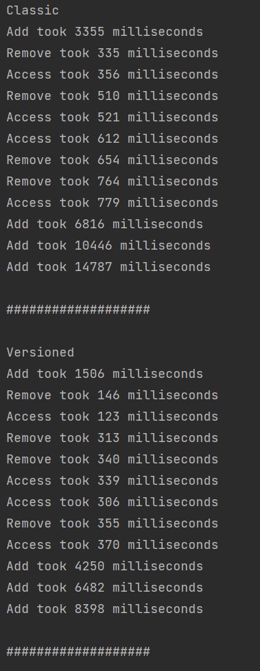
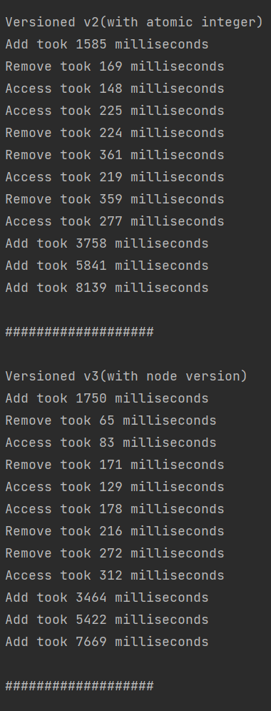
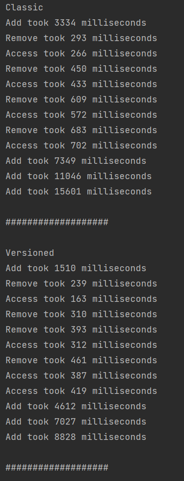
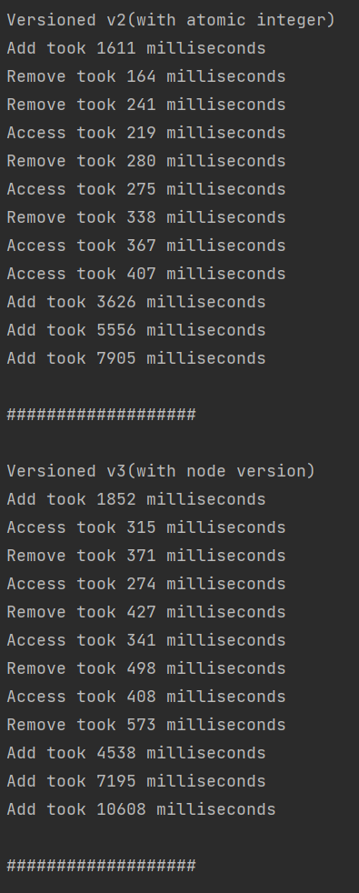

# Tema

## Exercitiul 1

a) linia 64 - pred.next = node; : aici legaturile sunt complete si nodul este adaugat in lista

b) linia 60 - return false; : aici sau la verificarea conditiei din if stim ca adaugarea a esuat

c) linia 91 - pred.next = current.next; : aici deoarece dupa aceasta linie de cod nodul devine inaccesibil

d) linia 94 - return false; : aici sau la (ne)verificarea conditiei din if stim ca eliminarea a esuat

## Exercitiul 2

a) nu este necesara fiindca variabila este atomica, metodele de incrementare, respectiv decrementare sunt atomice si nu
vor duce la inconsistente

b) coada nu va mai functiona corect deoarece avand cel putin 3 elemente in coada putem realiza secvente de tipul enq ->
deq -> enq pentru a adauga 2 noduri simultan(head va fi diferit dupa deq si vom avea 2 lock-uri la dispozitie) si in
cazul in care al doilea enq se realizeaza mai repede se pierde propietatea de fifo

c)

- da, ar merge in continuare bine coada
- fuziunea abordarilor va functiona corect

d) este necesar, daca nu ar fi in sectiunea protejata de lock mai multe thread-uri ar putea trece fara a vedea
modificarile facute de celelalte thread-uri si s-ar incerca elmiminarea mai multor elemente decat numarul de elemente
existente in coada

## Exercitiul 3

### Teste

Timpi de mai jos sunt duratele de executie ale fiecarui thread. Pentru a calcula durata unei operatii in medie pentru
respectivul thread vom imparti la numarul de valori cu, care acesta lucreaza, iar in cazul nostru fiecarui tip de thread
ii este asignat acelasi numar de valori.(n_tip_val_lucrez/n_thread_tip)

Input:

- Add: primele 100_000 valori: 4 threads
- Remove: primele 25_000 pare: 4 thread
- Access: access primele 25_000: 4 thread

Alta rulare

Se observa o imbunatarire de aproximativ 90-100% a timpului de executie al algoritmului prin adaugarea versionarii.

Ceea ce incetineste extrem de tare algoritmul pentru fiecare operatie add/remove/cotains este parcurgerea listei in faza
de verificare.

Din acest motiv am adaugat listei noastre o proprietate noua care sa ne spuna versiunea sa curenta. Orice operatie de
add/remove o va schimba intrucat sunt operatii care schimba lista noastra, dar nu si una de contains.

Inainte de a cere lock-ul pentru a altera lista vom salva o versiune a listei iar daca in momentul in care primim voie
sa lucram cu aceasta versiunea ramane neschimbata inseamna ca structura ei nu a fost modificata iar un nou validate ar
deveni inutil si consumator de timp.

Pentru versiunea 3 am adaugat versionare si la nivel de nod. Daca verificarea la nivel de lista esueaza, putem folosi
versiunile nodurilor dinainte de lock pe care le vom compara cu cele de dupa lock pentru a determina daca nodurile de
interes au fost modificate. Daca au fost modificate, facem verificarea clasica parcurgand lista.